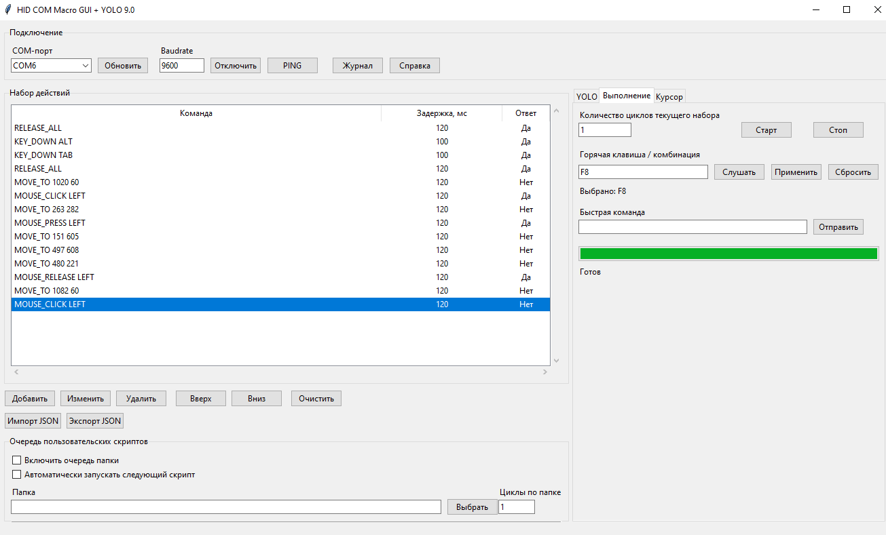
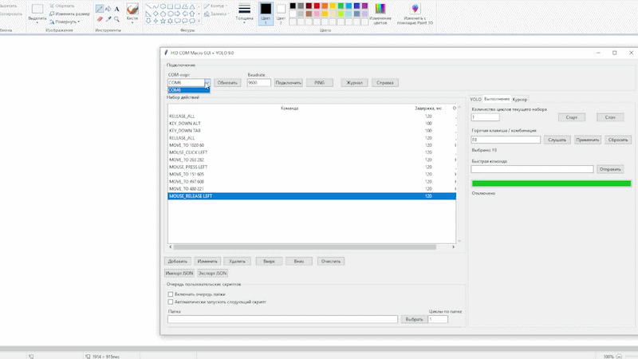

# COM_HID_PROJ

USB HID automation framework with optional YOLO object detection support.



## Demo

The example below demonstrates a simple automation scenario executed through the desktop client and Arduino HID device.



---

## Overview

COM_HID_PROJ is a desktop automation framework that combines:

* Arduino HID emulation
* Serial communication
* Macro execution
* Screen automation
* YOLO object detection

The project allows automation of mouse and keyboard interactions using either predefined commands or object detection results.

The Python application performs high-level automation logic while the Arduino device executes low-level HID operations.

---

## Architecture

```text
+----------------------+
| Python Desktop Client|
|----------------------|
| Macro Engine         |
| YOLO Integration     |
| Script Queue         |
| Hotkeys              |
+----------+-----------+
           |
           | Serial
           |
+----------v-----------+
| Arduino HID Device   |
|----------------------|
| Keyboard Emulation   |
| Mouse Emulation      |
+----------+-----------+
           |
           | USB HID
           |
+----------v-----------+
| Windows Applications |
+----------------------+
```

---

## Features

### HID Automation

* Keyboard emulation
* Mouse movement
* Mouse clicks
* Mouse wheel control
* Hotkey execution

### Macro System

* Macro editor
* JSON scenario storage
* Script queue support
* Multi-cycle execution
* Execution logging

### YOLO Integration

* Object detection
* Detection-based cursor movement
* Detection-based clicking
* Detection filtering by region
* Detection debugging tools

### Utilities

* Model testing tools
* Training GUI
* Overlay visualization
* Image detection tools

---

## Repository Structure

```text
COM_HID_PROJ
│
├── COM_HID_CLIENT_PYTHON
│   Desktop automation client
│
├── COM_HID_DEVICE
│   Arduino HID firmware
│
├── YOLO_DETECT
│   YOLO debugging and validation tools
│
├── YOLO_TRAIN
│   YOLO training GUI
│
├── docs
│   Documentation
│
└── requirements.txt
```

---

## Installation

Clone repository:

```bash
git clone <repository-url>

cd COM_HID_PROJ
```

Create virtual environment:

```bash
python -m venv .venv
```

Activate environment:

```bash
.venv\Scripts\activate
```

Install dependencies:

```bash
pip install -r requirements.txt
```

---

## Documentation

Detailed documentation is available in the `docs` directory.

### COM_HID_CLIENT_PYTHON

Desktop automation client.

Documentation:

```text
docs/COM_HID_CLIENT_PYTHON.md
```

### COM_HID_DEVICE

Arduino HID firmware.

Documentation:

```text
docs/COM_HID_DEVICE.md
```

### YOLO_DETECT

YOLO debugging and validation utilities.

Documentation:

```text
docs/YOLO_DETECT.md
```

### YOLO_TRAIN

YOLO training GUI.

Documentation:

```text
docs/YOLO_TRAIN.md
```

---

## Typical Workflow

1. Upload firmware to a supported Arduino HID board.
2. Start the desktop client.
3. Connect to the device through a COM port.
4. Create or load automation scenarios.
5. Optionally load a YOLO model.
6. Execute automation scripts.

---

## Requirements

### Hardware

* Arduino Leonardo / Micro / Pro Micro
* USB connection

### Software

* Windows 10 / 11
* Python 3.11+
* Arduino IDE

---

## Notes

Custom YOLO models are not included in this repository.

Training datasets are not included in this repository.

User automation scenarios are not included in this repository.

The repository provides the automation framework and development tools only.

---

## License

This project is licensed under the MIT License.

See the LICENSE file for details.
